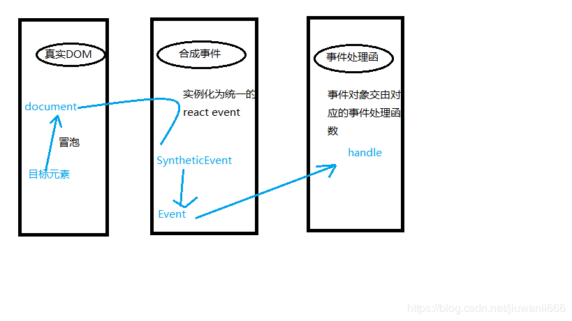

[TOC]

[React 官方文档](https://react.docschina.org/docs/getting-started.html)

如果你能深入理解 React 的灵魂，包括

- 虚拟 DOM，
- JSX，
- 函数式编程
- immutable
- 单向数据流，
- 组件化抽象，
- 生命周期等，

在面对其他轮子时你也能做到得心应手。

## 一、React 的特点

- 轻量级 DOM，以获得更好的性能。
- 在 React 中，**一切都被视为组件**。
- React 使用 **JSX（JavaScript eXtension）**，使我们可以编写类似于 HTML 的 JavaScript，**代码的可读性提高了**。 React 使用 JSX 来替代常规的 JavaScript。JSX 是一个看起来很像 XML 的 JavaScript 语法扩展。。
- React **不是直接运行在浏览器的文档对象模型（DOM）**上，而是**运行在虚拟 DOM 上**，保证代码不管怎么写，性能都不会太差。
- ReactJS 遵循**单向数据流**或单向数据绑定。

### [JSX 简介](https://react.docschina.org/docs/introducing-jsx.html)

### 为什么 react 要做成异步的呢

- 因为 state 更新会导致组件重新渲染，**在渲染后，才能把新的 props 传递到子组件上**，所以即使 state 做成同步，props 也做不成，为了保证 state 和 props 的一致性。
- 为了**性能优化**，state **会根据不同的优先级进行更新**。
- 为了让 react **更加灵活**，如实现异步过渡，例如页面在切换的时候，如果延时很小，就在后台自动渲染了，渲染好之后再进行跳转；如果延时相对较长，可以加一个 loading。

### React 之所以这么受欢迎，得益于它自身优势

- **灵活性和响应性**：React 提供最大的灵活性和响应能力。
- **虚拟 DOM**：由于它基于文档对象模型，因此它允许浏览器友好地以 HTML，XHTML 或 XML 格式排列文档。
- 可扩展性：由于其灵活的结构和可扩展性，React 已被证明对大型应用程序更好。
- 不断发展：React 得到了 Facebook 专业开发人员的支持，他们不断寻找改进方法致力于使其更先进。
- 丰富的 JavaScript 库：来自世界各地的贡献者正在努力添加更多功能。
- Web 或移动平台： React 提供 React Native 平台，可通过相同的 React 组件模型为 iOS 和 Android 开发本机呈现的应用程序。

## 二、基础理论

### 1. React 原理

一处开发，多处运行。组件重用。

- 每次数据变化 -> 重构虚拟 dom 树。
- 对比之前的虚拟 dom 树。
- 根据差异更新实际的浏览器 dom。

React 进行开发时所有的 DOM 构造都是通过**虚拟 DOM 进行**，每当数据变化时（setState 或者 props 改变的时候），React 都会重新构建整个 虚拟 DOM 树，然后 React 将当前整个 虚拟 DOM 树和上一次的 虚拟 DOM 树进行对比，**得到 虚拟 DOM 结构的区别，然后仅仅将需要变化的部分进行实际的浏览器 DOM 更新。**

尽管每一次都需要构造完整的虚拟 DOM 树，但是因为**虚拟 DOM 是内存数据**，性能是极高的，而对**实际 DOM 进行操作的仅仅是 Diff 部分**，因而能达到提高性能的目的。这样，在保证性能的同时，开发者将不再需要关注某个数据的变化如何更新到一个或多个具体的 DOM 元素，而只需要关心在任意一个数据状态下，整个界面是如何 Render 的。

### 2. react 的数据流

- 在 React 中，数据流是**自上而下单向的从父节点传递到子节点**，所以组件是简单且容易把握的，他们只需要从父节点提供的 props 中获取数据并渲染即可。
- 如果顶层组件的某个**props 改变**了，React 会**递归地向下遍历整棵组件数**，重新渲染所有使用这个属性的组件。
- 在组件内部，可以通过 this.props 来访问 props，props 是组件唯一的数据来源，**对于组件来说：props 永远是只读的。**
- React 的一大创新，就是**把每一个组件都看成是一个状态机**，组件**内部通过 state 来维护组件状态的变化，这也是 state 唯一的作用**。
- 你应该在应用中保持 自上而下的数据流，而不是尝试在不同组件中同步状态。

### 3. 纯函数，没有副作用的函数

纯函数是指**不依赖，不改变它作用域之外的变量状态的函数**。
也就是说，**纯函数的返回值只由它调用时的参数决定**，它的执行不依赖于系统的状态（比如：何时、何处调用它——译者注）。纯函数是函数式编程的一个基础。

### 4. react 设计理念

1. 组件**单一功能原则**：在理想状况下，一个组件应该只做一件事情。如果这个组件功能不断丰富，它应该被分成更小的组件。
2. 定义 UI 状态的最小(但完整)表示。
3. 确定你的 **State（props|state）** 应该位于哪里。

### 5. 为什么要引入 React

`import React, {Component} from 'react'`，从本质上讲，JSX 只是为 React.createElement(component, props, ...children) 函数提供的语法糖。

这里的 **React 在 babel 转化的过程中要用到**，所以需要引入。

无状态组件通过 babel-plugin-react-require 来实现 react 的自动导入，实际上该插件的功能非常简单，就是在转译时，在文件头插入 import React from 'react';。

同时需要注意的是，**该插件只对未继承 React.Component 的无状态函数式组件生效**，因此对于其它 react 函数，则仍需手动引入 react!

### 6. 核心算法， diff 算法

[参阅文章](https://juejin.im/post/5be969656fb9a049ad76931f)
[React Fiber 原理介绍](https://segmentfault.com/a/1190000018250127)

#### react15 之前可能出现的问题

当组件树越来越大，递归遍历的成本就越高，持续占用主线程，这样主线程上的布局、动画等周期性任务以及交互响应就无法立即得到处理，**造成顿卡的视觉效果**。

##### 在 react@15 中，更新主要分为两个步骤完成

1. **diff** diff 的实际工作是对比 prevInstance 和 nextInstance 的状态，找出差异及其对应的 VDOM change。diff 本质上是一些计算（遍历、比较），是可拆分的（算一半待会儿接着算）。
2. **patch** 将 diff 算法计算出来的**差异队列更新到真实的 DOM 节点上**。React 并不是计算出一个差异就执行一次 patch，而是**计算出全部的差异并放入差异队列后，再一次性的去执行 patch 方法完成真实的 DOM 更新**。

#### 解决问题 React Fiber

React Fiber 是对 React 核心算法的重写。

**将要执行的 JS 做拆分，保证不会阻塞主线程（Main thread）即可**。fiber tree 是根据 VDOM tree 构造出来的，树形结构完全一致，只是包含的信息不同。

**旧版 React 通过递归的方式进行渲染**，使用的是 JS 引擎自身的函数调用栈，它会一直执行到栈空为止。

而 **Fiber 实现了自己的组件调用栈**，它以**链表的形式遍历组件树**，可以灵活的暂停、继续和丢弃执行的任务。实现方式是使用了浏览器的 requestIdleCallback 这一 API。

> requestIdleCallback 会让一个低优先级的任务在空闲期被调用，而 requestAnimationFrame 会让一个高优先级的任务在下一个栈帧被调用，从而保证了主线程按照优先级执行 fiber 单元。 优先级顺序为：文本框输入 > 本次调度结束需完成的任务 > 动画过渡 > 交互反馈 > 数据更新 > 不会显示但以防将来会显示的任务。

##### Fiber 具体

从 Stack Reconciler 到 Fiber Reconciler。

React 框架内部的运作可以分为 3 层：

- **Virtual DOM** 层，描述页面长什么样。
- **Reconciler** 层，**负责调用组件生命周期方法，进行 Diff 运算**等。
- **Renderer** 层，根据不同的平台，**渲染出相应的页面**，比较常见的是 ReactDOM 和 ReactNative。

这次改动最大的当属 Reconciler 层了，React 团队也给它起了个新的名字，叫**Fiber Reconciler**。这就引入另一个关键词：Fiber。

Fiber Reconciler 每执行一段时间，都会将控制权交回给浏览器，**可以分段执行**。

对任务进行分层级，通过任务调度器，优先级高的任务（如键盘输入）可以打断优先级低的任务（如 Diff）的执行，从而更快的生效。

## 三、state 与 props

### 1. 正确地使用状态（state）

可以认为 state 是私有的状态。

- 使用 setState 方法 来更新状态；
- 异步：React 可以将**多个 setState() 调用合并成一个调用来提高性能**。因为 this.props 和 this.state 可能是**异步更新**的，你不应该依靠它们的值来计算下一个状态。可以使用函数加参数的形式来解决这个问题；

```js
// Wrong
this.setState({
  counter: this.state.counter + this.props.increment
});
// Correct
this.setState((prevState, props) => ({
  counter: prevState.counter + props.increment
}));
```

- 状态更新合并：当你调用 setState() 时，React 将你提供的对象**合并到当前状态**。

### 2. props 是组件的固有属性

props 是只读的，组件无论是否使用，都决不能修改自身的 props。

如果需要修改 props，就需要父组件同时传递修改 props 的方法，在子组件中调用来修改，比如 updateState。

React 非常灵活，但它也有一个严格的规则：所有 React 组件都必须像纯函数一样保护它们的 props 不被更改。

#### props 与 state 的选择

- State: 如果 UI 需要更改就表示某处肯定会有 state
- Props: 用来传递数据、传递控制

### 3. 为什么 constructor 里要调用 super 和传递 props

```js
class Checkbox extends React.Component {
  constructor(props) {
    super(props);
    this.state = { isOn: true };
  }
  // ...
}

// 等价于如下
// class fields proposal形式，这使得像 state = {} 这类表达式能够在需要的情况下引用 this.props 和 this.context 的内容。
class Checkbox extends React.Component {
  // 这里组件会默认调用super(props);
  state = { isOn: true };
  // ...
}
```

在 JavaScript 中，**super 指的是父类（即超类）的构造函数**。一般在 React 组件中，指代 React.Component 这个父类的构造函数。

在调用父类的构造函数之前(也就是 super 之前)，你是不能在 constructor 中使用 this 关键字的。

在组件实例化的时候，会有如下`super(props); => this.props = props;`，这样在构造函数内的语句就可以使用 props 了，否则如果不传入 props，这个时候也会在实例生成的时候添加 props，这样就会导致**在构造函数内的语句**没法使用 props。

即便你调用 super() 的时候**没有传入 props**，你依然能够在 render 函数或其他方法中访问到 this.props。**这是因为在生成实例的时候，props 会被添加到实例上。**

```js
// React 内部
const instance = new YourComponent(props);
instance.props = props;
```

### 4. 为什么要 setState

[setState 文档](https://zh-hans.reactjs.org/docs/react-component.html#setstate)

setState() **将对组件 state 的更改排入队列**，**并通知** React 需要使用更新后的 state **重新渲染此组件及其子组件**。这是用于更新用户界面以响应事件处理器和处理服务器数据的主要方式。

将 setState() 视为**请求而不是立即更新组件**的命令，React 并不会保证 state 的变更会立即生效。

它会批量推迟更新。

除非 shouldComponentUpdate() 返回 false，否则 setState() 将始终执行重新渲染操作。

setState 做的事情**不仅仅只是修改了 this.state** 的值，另外最重要的是它会触发 React 的**更新机制**，**会进行 diff ，然后将 patch 部分更新到真实 dom 里**。

如果你直接 `this.state.xx == oo` 的话，**state 的值确实会改，但是改了不会触发 UI 的更新，那就不是数据驱动了**。这样的话，在不需要触发 ui 更新的时候倒是**可以一用**啊。

#### setState 的更新原理（调用 setState 之后发生了什么）

数据合并更改 -> 渲染流程。

1. 在代码中调用 setState 函数之后，**React 会将传入的参数对象与组件当前的状态合并**，然后触发所谓的**调和过程**（**Reconciliation**）。
2. 经过调和过程，React 会以相对高效的方式根据新的状态**构建 React 元素树并且着手重新渲染整个 UI 界面**。
3. 在 React 得到元素树之后，React 会**自动计算出新的树与老树的节点差异**，然后根据差异对界面进行**最小化重渲染**。
4. 在差异计算算法中，React 能够相对精确地知道哪些位置发生了改变以及应该如何改变，这就保证了按需更新，而不是全部重新渲染。

#### setState 是同步还是异步，注意值的改变与页面重新渲染

注意区分两种类型的操作：

- **生命周期和合成事件中**
- **异步代码和原生事件中**

**执行过程代码同步的**，只是**合成事件**和**生命周期（钩子）函数**的调用顺序**在更新之前**，导致在合成事件和钩子函数中**没法立马拿到更新后的值**。

“异步”，所以表现出来有时是同步，有时是“异步”。

- 只在合成事件和钩子函数中“**页面更新是异步**”的，
- 在原生事件(获取 dom，手动绑定事件)和 setTimeout/setInterval 等原生 API 中**都是同步**的。

简单的可以理解为**被 React 控制的函数里面就会表现出“异步”**，反之表现为同步。

`setState`本身并不是异步的，而是 `React` 的**批处理机制**给人一种异步的假象。

##### 那为什么会出现异步的情况呢，多个 setState

为了**做性能优化**，将 state 的更新延缓到最后**批量合并再去渲染**对于应用的性能优化是有极大好处的，**如果每次的状态改变都去重新渲染真实 dom，那么它将带来巨大的性能消耗**。

##### 那如何在表现出异步的函数里可以准确拿到更新后的 state 呢

一、通过第二个参数 `setState(partialState, callback)`中的 callback 拿到更新后的结果。或者可以通过给 setState 传递函数来表现出同步的情况：

```js
this.setState(state => {
  return { val: newVal };
});
```

二、使用在 componentDidUpdate 中获取。

##### 那表现出异步的原理是怎么样的呢

在 React 的 setState 函数实现中，会根据 `isBatchingUpdates(默认是 false)` 变量判断是否直接更新 this.state 还是放到队列中稍后更新。然后有一个 **batchedUpdate 函数**，可以修改 isBatchingUpdates 为 true，

当 React **调用事件处理函数**之前，或者**生命周期函数**之前就会调用 batchedUpdate 函数，这样的话，setState 就不会同步更新 this.state，而是放到更新队列里面后续更新。

## 四、事件，构建 react 的反向数据流

React 通过将事件处理器**绑定到组件上来处理事件**。

React 事件**本质上和原生 JS 一样**，鼠标事件用来处理点击操作，表单事件用于表单元素变化等，Rreact 事件的命名、行为和原生 JS 差不多，不一样的地方是 **React 事件名区分大小写**。

### 1. react 合成事件和 DOM 原生事件的区别

#### 一般的事件监听

事件捕获 -> 事件冒泡

使用 addEventListener 函数在事件流的的不同阶段监听事件。

`DOMEle.addEventListener(‘事件名称’,handleFn,Boolean);`

此处第三个参数 Boolean 即代表监听事件的阶段；
为 true 时，在在捕获阶段监听事件，执行逻辑处理；
为 false 时，在冒泡阶段监听事件，执行逻辑处理。

#### react 合成事件

如果 react 事件绑定在了真实 DOM 节点上，一个节点同时有多个事件时，页面的响应和内存的占用会受到很大的影响。因此**SyntheticEvent 作为中间层**出现了。

**事件没有在目标对象上绑定，而是在 document 上监听所支持的所有事件**，当事件发生并冒泡至 document 时，**react 将事件内容封装并叫由真正的处理函数运行**。



**React 事件处理机制自动实现了事件委托，对所有绑定事件进行统一处理，没有绑定到对应的 DOM 元素上，所以直接在 jsx 中绑定到 li 上并不会影响对性能**。

### 2. 概述下 React 中的事件处理逻辑

React 在组件**加载(mount)和更新(update)时**，将事件通过 addEventListener 统一注册到 document 上，然后**会有一个事件池存储了所有的事件**，当事件触发的时候，**通过 dispatchEvent 进行事件分发**。

#### 语法上的差异

- React 事件绑定属性的命名采用**驼峰式写法**，而不是小写。
- 如果采用 JSX 的语法你需要**传入一个函数作为事件处理函数**，而不是一个字符串(DOM 元素的写法)。

```js
// 向事件处理程序传递参数：this指代当前的组件
<button onClick={this.preventPop.bind(this, id)}>Delete Row</button>
preventPop(name, e){ // 事件对象e要放在最后
  e.preventDefault();
  alert(name);
}
```

值得注意的是，**通过 bind 方式向监听函数传参**，在类组件中定义的监听函数，事件对象 e 要排在所传递参数的后面。

- 在 React 中另一个不同是你不能使用返回 false 的方式阻止默认行为。你**必须明确的使用** preventDefault。
- 在这里，e 是一个合成事件对象。

### 3. 事件调用的时候，回调中的 this

要看事件是如何绑定的，如果直接绑定 this，this(引用放最后)，就指向当前的组件或者元素。
如果绑定了组件，然后又使用函数的形式，通过函数的参数传递给回调函数。

#### 为什么调用方法要 bind this

```js
// 如下代码是有问题的，发现会报 this 是 undefined 的错
class Foo extends React.Component {
  handleClick() {
    this.setState({ xxx: aaa });
  }

  render() {
    return <button onClick={this.handleClick}>Click me</button>;
  }
}
```

因为 **render 多次调用每次都要 bind 会影响性能**，所以官方建议你自己在 constructor 中手动 bind 达到性能优化。

在 JavaScript 中，**class 的方法默认不会绑定 this，这里对应的是一般函数，如果是尖头函数，就是哪里定义 this 指向哪里**。如果你忘记绑定 this.handleClick 并把它传入了 onClick，当你调用这个函数的时候 this 的值为 undefined。

所以通常有两种形式来处理这个问题。

#### 添加 bind 绑定当前组件

```js
class Foo extends React.Component {
  handleClick() {
    this.setState({ xxx: aaa });
  }
  // 性能不太好，这种方式跟 react 内部绑定 bind 一样的，每次 render 都会进行 bind，而且如果有两个元素的事件处理函数式同一个，也还是要进行 bind
  render() {
    return <button onClick={this.handleClick.bind(this)}>Click me</button>;
  }
}

// 或者
class Foo extends React.Component {
  constructor(props) {
    super(props);
    this.state = {};
    // 相比于第一种性能更好，因为构造函数只执行一次，那么只会 bind 一次
    this.handleClick = this.handleClick.bind(this);
  }
  handleClick() {
    this.setState({ xxx: aaa });
  }

  render() {
    return <button onClick={this.handleClick}>Click me</button>;
  }
}
```

#### 使用箭头函数

```js
class Foo extends React.Component {
  handleClick() {
    this.setState({ xxx: aaa });
  }
  render() {
    // 每次 render 都会重复创建函数，性能会差一点。
    return <button onClick={e => this.handleClick(e)}>Click me</button>;
  }
}
class Foo extends React.Component {
  // 好看，性能好。没有明显缺点
  handleClick = () => {
    this.setState({ xxx: aaa });
  };
  render() {
    return <button onClick={this.handleClick}>Click me</button>;
  }
}
```

## 五、组件，component

### 1. react 组件的生命周期函数

[官方图示组件的生命周期函数](http://projects.wojtekmaj.pl/react-lifecycle-methods-diagram/)

- 挂载阶段
- 更新阶段
- 卸载阶段

#### 初始化阶段，实例生成到挂载

- `constructor`: 这是给组件“带来生命”时**调用的第一个方法**。通常，你会在 constructor 方法中**初始化 state 和绑定事件处理程序**。
  <!-- - 废弃，`getInitialState`: 获取每个实例的**初始化状态**，React 在 ES6 的实现中去掉了 getInitialState 这个 hook 函数,规定 state 在**constructor 中实现**。 -->
  <!-- - 废弃，`getDefaultProps`: 获取实例的默认属性（ES5 中的语法），改为 `component.defaultProps={}`来设置 -->
  <!-- - 不建议使用，`componentWillMount`：组件即将被装载、渲染到页面上，**调用一次**，相当于 jq 的 ready。**这个方法将要废弃，后续放弃支持**，使用`omponentDidMount`替代。 -->
- `static getDerivedStateFromProps(props, state)`，在初始化的阶段会使用到，静态方法，没法使用 this。
- `render`: 组件在这里**生成虚拟的 DOM 节点**。
- `componentDidMount`: **组件真正在被装载之后**，相当于模板+数据生成代码片段**插入页面之后的操作**。这个阶段可以做如下的操作：
  - 数据请求（当然不影响页面渲染的部分也可以在 componentWillMount 生命周期请求）
  - 这个时候，页面已经挂载，可以获取节点，使用 setState()会触发重新渲染(re-render)。
  - React 更新 ­D­O­M 和 refs。可以获取 dom 和使用 refs。

#### 更新，运行中状态

- [`static getDerivedStateFromProps(props, state)`](https://zh-hans.reactjs.org/docs/react-component.html#static-getderivedstatefromprops)，会在调用 render 方法之前调用，并且在**初始挂载及后续更新时都会被调用**，state 改变的时候，也会调用，**整合了 willMount 和 willUpdate**。它应返回一个对象来更新 state，如果返回 null 则不更新任何内容。不能使用 this。此方法适用于[罕见的用例](https://zh-hans.reactjs.org/blog/2018/06/07/you-probably-dont-need-derived-state.html#when-to-use-derived-state)，**即 state 的值在任何时候都取决于 props**。
  <!-- - 废弃，`componentWillReceiveProps`: 组件**将要接收到新的 props 属性**的时候调用，**初始化的时候不调用**，将要废弃。 -->
- `shouldComponentUpdate(nextProps, nextState)`: 组件**接受到新属性或者新状态的时候**（可以返回 false，接收数据后不更新，阻止`render`调用，后面的函数不会被继续执行了）。在**PrueComponent**中默认有，不能主动添加。
  <!-- - 废弃，`componentWillUpdate`: 组件即**将更新**，不能修改属性和状态，首次渲染的时候不调用，能放在这里的都是可以放在 render 函数中的，将要放弃。通常，此方法可以替换为 `componentDidUpdate()`。**如果你在此方法中读取 DOM 信息**（例如，为了保存滚动位置），则可以将此逻辑移至 `getSnapshotBeforeUpdate()` 中。 -->
- `render`: 组件重新描绘
- `getSnapshotBeforeUpdate()`: **在最近一次渲染输出（提交到 DOM 节点）之前调用。**它使得组件能在发生更改之前从 DOM 中捕获一些信息（例如，滚动位置）。此生命周期的**任何返回值将作为参数传递给 componentDidUpdate()**。不常用。
- `componentDidUpdate`: 组件已经更新

##### shouldComponentUpdate(nextProps, nextState): boolean

组件更新: `shouldComponentUpdate(nextProps, nextState): boolean`，在组件**挂载之后**，再接收到**新的 props 或者 state 时被执行**。

- 在**初始化时**或者**使用 forceUpdate**时**不被执行**。可以在你确认不需要更新组件时使用。
- 返回 boolean， 当组件做出**是否要更新 DOM 的决定的时候被调用**。
- 如果 shouldComponentUpdate 返回 false, render()则会在**下一个 state change 之前被完全跳过**。(另外 componentWillUpdate 和 componentDidUpdate 也不会被执行)；

#### 卸载，销毁阶段

- `componentWillUnmount`: 组件即将销毁

卸载就是真正的移除，所以不存在 DidUnMount。

#### 错误处理的生命周期

当渲染过程，生命周期，或子组件的构造函数中**抛出错误时**，会调用如下方法：

- [`static getDerivedStateFromError()`](https://zh-hans.reactjs.org/docs/react-component.html#static-getderivedstatefromerror)，此生命周期会在后代组件抛出错误后被调用。 它将抛出的错误作为参数，并返回一个值以更新。
- [`componentDidCatch()`](https://zh-hans.reactjs.org/docs/react-component.html#componentdidcatch)。componentDidCatch() 会在“提交”阶段被调用，因此允许执行副作用。它应该用于记录错误之类的情况。

### 2. react 性能优化是哪个周期函数

`shouldComponentUpdate`这个方法用来判断**是否需要调用 render 方法重新描绘 dom**。因为 dom 的描绘非常消耗性能，**如果我们能在 shouldComponentUpdate 方法中能够写出更优化的 dom diff 算法**，可以极大的提高性能。

### 3. HOC 高阶组件，对应 js 的高阶函数

具体而言，高阶组件就是一个函数，且该函数接受一个组件作为参数，并返回一个新的组件。

高阶组件（HOC）是 react 中**对组件逻辑进行复用的高级技术**。但高阶组件本身并不是 React API。它**只是一种模式**，这种模式是由 react 自身的组合性质必然产生的。

React 中的高阶组件是一种在组件之间**共享通用功能**而无需重复代码的模式。

对比组件将 props 属性转变成 UI，**高阶组件则是将一个组件转换成另一个新组件**。

```js
const EnhancedComponent = higherOrderComponent(WrappedComponent);
```

参考实例中的 hoc。

#### HOC 在业务场景中有哪些实际应用场景

`HOC`可以实现的功能：

- 组合渲染
- 条件渲染
- 操作 `props`
- 获取 `refs`
- 状态管理
- 操作 `state`
- 渲染劫持

`HOC`在业务中的**实际应用场景**：

- 日志打点
- 权限控制
- 双向绑定
- 表单校验

#### React 高阶组件的写法，通常有哪几种

- 第一种是通过**属性代理**直接包裹组件，操作组件的 props；
- 第二种是通过组件**反向继承**的方式，拦截生命周期、state、渲染过程。

#### 高阶组件(HOC)和 Mixin 的异同点

Mixin 和 HOC 都可以用来解决 React 的代码复用问题。

- Mixin 可能会相互依赖，相互耦合，不利于代码维护
- 不同的 Mixin 中的方法可能会相互冲突
- Mixin 非常多时，组件是可以感知到的，甚至还要为其做相关处理，这样会给代码造成滚雪球式的复杂性

而 HOC 的出现可以解决这些问题

- 高阶组件就是一个没有副作用的纯函数，各个高阶组件不会互相依赖耦合
- 高阶组件也有可能造成冲突，但我们可以在遵守约定的情况下避免这些行为
- 高阶组件并不关心数据使用的方式和原因，而被包裹的组件也不关心数据来自何处。高阶组件的增加不会为原组件增加负担

#### 使用高阶组件

与 dva/connect 方法类似。

- @修饰符
- 直接调用函数

[具体 demo，查看](./react-features-test/src/pages/hoc)

### 4. PureComponent，纯组件，添加了 shouldComponentUpdate 生命周期的组件

React.PureComponent 类似于 React.Component。它们的不同之处在于 React.Component **没有实现 shouldComponentUpdate()**，**但是 React.PureComponent 实现了它**。采用对属性和状态用**浅比较**的方式。

React.PureComponent 通过浅层 props 和状态比较来实现它。也就是**比较引用对象的指向**，所以在改变引用类型的值的时候，是不会触发 render 的，在某些场景下你可以使用 React.PureComponent 来提升性能。

### 5. 数据获取应该放在哪个阶段

componentWillMount|componentDidMount

1、通常我在 componentWillMount 发送 ajax(渲染 dom 之前做的操作)
2、componentDidMount 也可以做 ajax 操作（渲染 dom 完成之后做的操作）

那么，这 2 种情况如何区分呢？

需求 1：

当你的 render 函数需**要有数据才能渲染的时候**，就在 componentWillMount 做操作，但是异步请求也不能确保返回之后才渲染，所以这里没有意义。

```js
render() {
  return data && <div>{data}</div>
}
```

需求 2：

当你的 render 不需要数据，先渲染 dom 结构，就在 componentDidMount 操作。

```js
render() {
  const { data } = this.props
  return (
    <div>
      <span>我要先渲染</span>
      <span>{data || ''}</span>
    </div>
  )
}
```

### 6. 为什么虚拟 dom 会提高性能

#### 虚拟 dom 与真实 dom 的区别

| 真实的 DOM                          | 虚拟 DOM                              |
| :---------------------------------- | :------------------------------------ |
| 1. 更新较慢                         | 1. 更新较快                           |
| 2. 可以直接更新 HTML                | 2. 不能直接更新 HTML                  |
| 3. 元素更新时候创建一个新的 DOM     | 3. 元素更新时候更新 JSX               |
| 4. DOM 操作开销较大                 | 4. **DOM 操作开销较小**               |
| 5. 内存浪费严重（大量不必要的属性） | 5. 没有内存浪费（对象属性都是需要的） |

#### 原理

虚拟 dom 相当于在 js 和真实 dom 中间**加了一个缓存**，利用 **dom diff 算法避免了没有必要的 dom 操作，从而提高性能**。

**虚拟 DOM 是轻量级的 JavaScript 对象**，一开始只是真实 DOM 的一个副本。它是一个节点树，将组件列为对象及其属性和内容的列表。

React 的渲染功能从 React 的各个部分生成一个节点树。然后，它会根据由不同用户或系统行为引起的信息模型突变来更新此树。

#### 虚拟 DOM 具体实现步骤如下

1. 用 JavaScript 对象结构表示 DOM 树的结构，然后用这个树构建一个**真正的 DOM 树**，插到文档当中；
2. 当**状态变更**的时候，重新构造一棵新的**对象树**，虚拟 dom 结构。然后用新的树和旧的树进行比较，记录两棵树差异；
3. 把 2 所记录的差异应用到步骤 1 所构建的真正的 DOM 树上，视图就更新。


### 7. diff 算法，Fiber Reconciler

- 把树形结构**按照层级分解**，只比较**同级元素**。
- 给列表结构的每个单元添加唯一的 **key 属性**，方便比较。
- React 只会匹配相同 class 的 component（这里面的 class 指的是**组件的名字**）。
- 合并操作，调用 component 的 setState 方法的时候, React **将其标记为 - dirt**，到每一个事件循环结束, React 检查所有标记 dirty 的 component 重新绘制。
- **选择性子树渲染。开发人员可以重写 shouldComponentUpdate 提高 diff 的性能**

### 8. 动态添加多个 class

1. 拼接字符串的方式，或者写成一个字符串，原理应该也一样。

```jsx
let indexNum = 11;
<li className={`icon biaxial ${indexNum > 1 ? 'unavailable' : ''}`}>
  拆分多图
</li>;
```

这样对于 styles.className 类型的就不太行了。

2. 引入 classnames 库，来控制多个 class 的添加与移除。

```jsx
const inputClass = classNames(styles.input, {
  [styles.show]: searchMode
});
```

### 9. react 的性能优化方案/介绍 react 优化

#### 分析组件加载时间

在最新的 React16 版本中，我们可以直接在 url 后加上`?react_pref`，就可以**在 chrome 浏览器的 performance**，我们可以查看 User Timeing 来查看组件的加载时间。

#### react 优化具体策略

- render 里面尽量**减少新建变量和 bind 函数**，传递参数是尽量减少传递参数的数量。
- 定制 shouldComponentUpdate 函数，来避免不必要的 rerender。
- Immutable.js，共享的可变状态是万恶之源，通过 Immutable 创建的 Immutable Data 一旦被创建，就不能再更改。**对 Immutable 对象进行修改、添加或删除操作，都会返回一个新的 Immutable 对象**。
- 多个 react 组件性能优化，**key 的优化**
- 尽量减少 rerender，如减少 setState
- 使用 production 版本的 react.js，减小文件的体积

### 10. react 的父子组件的每个生命周期是怎么触发的

是洋葱型的还是顺序执行的呢。

```js
// 参见react-features-test/feature4_6/Parent
```

父组件的状态改变的时候，相对于子组件多出来一个 componentWillReceiveProps 事件。

很**明显的洋葱类型**，**父组件只有在子组件挂载完成的时候，才能算是挂载完成**。

这里父组件的状态改变，使用到的子组件会重新渲染。

### 11. render()

对于一个组件来说，render 是**唯一一个必须的方法**。render 方法需要满足这几点：

- 只能通过 this.props 或 this.state 访问数据
- 只能出现**一个顶级组件**，且必须，或者可用 React。Fragment
- 可以返回 null、false 或任何 React 组件
- 不能对 props、state 或 DOM 进行修改，会造成重复 componentWillUpdate

需要注意的是，render 方法**返回的是虚拟 DOM**。

#### 主动更新（重新渲染）

React 元素都是 **immutable** 不可变的。**当元素被创建之后，你是无法改变其内容或属性的**。一个元素就好像是动画里的**一帧**，**它代表应用界面在某一时间点的样子**。
根据我们现阶段了解的有关 React 知识，更新界面的**唯一办法是创建一个新的元素**，然后将它传入 ReactDOM.render() 方法。

React DOM 首先会比较**元素内容先后的不同**，而在渲染过程中只会更新改变了的部分。

### 12. React.lazy()配合 Suspense，组件懒加载

[官方文档](https://zh-hans.reactjs.org/docs/code-splitting.html#reactlazy)

为了**避免搞出大体积的代码包**，在前期就思考该问题并对**代码包进行分割**是个不错的选择。 代码分割是由诸如 Webpack，Rollup 和 Browserify（factor-bundle）这类打包器支持的一项技术，能够创建多个包并在运行时动态加载。

对你的应用进行代码分割能够帮助你“**懒加载**”当前用户所需要的内容，**能够显著地提高你的应用性能**。

尽管并没有减少应用整体的代码体积，**但你可以避免加载用户永远不需要的代码**，**并在初始加载的时候减少所需加载的代码量**。

React.lazy 和 Suspense 技术**还不支持服务端渲染**。

React.lazy 函数能让你像渲染常规组件一样处理动态引入（的组件）。

一个不错的选择是从路由开始。大多数网络用户习惯于页面之间能有个加载切换过程。你也可以选择重新渲染整个页面，这样您的用户就不必在渲染的同时再和页面上的其他元素进行交互。

React.lazy 目前只支持**默认导出（default exports）**。如果你想被引入的模块使用命名导出（named exports），你可以创建一个中间模块，来重新导出为默认模块。

查看`react-features-test/Routes.js`。

fallback 属性接受任何在组件加载过程中你想展示的 React 元素。你可以将 Suspense 组件置于懒加载组件之上的任何位置。你甚至可以用一个 Suspense 组件包裹多个懒加载组件。

#### React.lazy 用途

- 一般的组件懒加载；
- 异常捕获边界（Error boundaries）；
- 路由组织，加快首次加载速度。

### 定义一个组件时候，如何决定要用 Functional(stateLess) 还是 Class

- 简单的用 Functional，复杂的用 Class
- **不需要组件内状态的用 Functional**，当做纯的渲染模版。需要的用 Class，不过出现 hook 之后，无状态组件也可以添加内部状态，并且有副作用函数钩子。

组件的创建类型，主要有如下三种类型：

1. React.createClass
2. ES6 的 class... extends React.Component 类型
3. Function Component

#### es5 原生方式 React.createClass 定义的组件

```js
var InputControlES5 = React.createClass({
  propTypes: {
    //定义传入props中的属性各种类型
    initialValue: React.PropTypes.string
  },
  defaultProps: {
    // 只能用在ES5的函数中
    //组件默认的props对象
    initialValue: ''
  },
  // 设置 initial state
  getInitialState: function() {
    //组件相关的状态对象
    return {
      text: this.props.initialValue || 'placeholder'
    };
  },
  handleChange: function(event) {
    this.setState({
      //this represents react component instance
      text: event.target.value
    });
  },
  render: function() {
    return (
      <div>
        Type something:
        <input onChange={this.handleChange} value={this.state.text} />
      </div>
    );
  }
});
InputControlES6.propTypes = {
  initialValue: React.PropTypes.string
};
InputControlES6.defaultProps = {
  initialValue: ''
};
```

#### es6 形式的 extends React.Component 定义的组件

```js
class InputControlES6 extends React.Component {
  constructor(props) {
    super(props);

    // 设置 initial state
    this.state = {
      text: props.initialValue || 'placeholder'
    };

    // ES6 类中函数必须手动绑定
    this.handleChange = this.handleChange.bind(this);
  }

  handleChange(event) {
    this.setState({
      text: event.target.value
    });
  }

  render() {
    return (
      <div>
        Type something:
        <input onChange={this.handleChange} value={this.state.text} />
      </div>
    );
  }
}
InputControlES6.propTypes = {
  initialValue: React.PropTypes.string
};
InputControlES6.defaultProps = {
  initialValue: ''
};
```

#### Function Component，函数组件（state less）

```jsx
function FC(props){
  const [count, setCount] = useState(0)
  return (
  <div>
    {count}
    <button onClick={()=>{setCount(count+1)}}>+1</button>
    {props.children}
  </div>
}
```

相当于一个模板函数，class component 内的一个渲染单元。

#### 为什么对于使用 react, 总说 Function Component 是最轻量的呢

- **轻量是对于 js 解析过程中的开销来说的**，**函数式组件不需要创建 class 所必需的一些对象，方法等，只需要拿到数据，然后组装就好了**。
- 函数组件**不需要 new 来生成实例**；
- 函数组件**不需要挂载生命周期**。

### from 表单的操作

#### 设置默认值

`defaultValue="value"`，设置默认选中 `defaultChecked`；

```jsx
<form onSubmit={this.handleSubmit}>
  // 这里可以设置确认按钮的操作，更加语义化
  <label>
    Name:
    <input
      defaultValue="Bob"
      type="text" // 一般的文本操作，设置defaultValue="value",与ref共同构建非受控组件。
      ref={input => (this.input = input)}
    />
  </label>
  <input type="submit" value="Submit" />
</form>
```

#### input 标签的 disabled 设置

```jsx
let disabled = isReadonly ? { disabled: 'disabled' } : {};
<input {...disabled} />;
```

### 受控组件与非受控组件

**React 内部分别使用了 props, state 来区分组件的属性和状态**。props 用来定义组件外部传进来的属性, 属于那种经过外部定义之后, 组件内部就无法改变。而 state 维持组件内部的状态更新和变化, 组件渲染出来后响应用户的一些操作,更新组件的一些状态。

#### 非受控组件

与状态无关，通过 ref 获取节点，来获取值。用于表单统一，不需要控制外部变更 ui。

**非受控组件即组件的状态改变不受 props 与 state 控制**，根据默认行为进行交互动作。

- HTML 表单元素与 React 中的其他 DOM 元素有所不同,因为表单元素**生来就保留一些内部状态**。
- 在 HTML 当中，像`<input>`,`<textarea>`, 和`<select>`这类表单元素**会维持自身状态**，并根据用户输入进行更新。但在 React 中，可变的状态通常保存在组件的状态属性中，并且只能用 setState()，方法进行更新。
- 使用”受控组件”,每个状态的改变**都有一个与之相关的处理函数**。这样就可以直接修改或验证用户输入。
- 非受控表单，设置 ref，便于引用操作。
- 设置 defaultValue || defaultCkecked 来设置初始状态

```jsx
<input
  ref={input => {
    this.input = input;
  }}
  defalutValue={defaultValue}
/>
```

#### 受控组件，设置的 value，对应 state 的值，逆向通过 onChange 事件回传

组件的可更改的位置的状态都保存在 state 与 props 中，每次页面操作都通过`onChange`回传反馈到 state 上。

- 初始值在初始 state|props 的时候给出
- 必须有事件来改变状态从而改变显示
- 可以对输入内容进行一些操作，比如**格式化**等
- 受控表单，需要设置 value，并且设置改变状态的函数 onchange

```jsx
<input
  value={value}
  onChange={this.handleChange.bind(this)}
  ref={ref => (this.input = ref)}
/>
```

当每次的输入结果都**会影响操作的时候**，事件操作在`onChange`事件中更改 state，同时触发响应的别的操作。

### setState 的工作原理，多次 setState

setState，合并渲染（渲染是异步的），但是**数据是实时更新**的。

```js
...
state = {
    count: 0
}
componentDidMount() {
  this.setState({count: this.state.count + 1})
  this.setState({count: this.state.count + 1})
  this.setState({count: this.state.count + 1})
}
...
```

看起来 state.count 被增加了三次，**但结果是增加了一次**。这并不奇怪：

React 快的原因之一就是，在执行`this.setState()`时，React 没有忙着立即更新`state`，只是把新的`state`存到一个**队列**（`batchUpdate`）中。

上面三次执行`setState`只是对传进去的对象进行了合并,然后再**统一处理（批处理）**，触发重新渲染过程，因此只重新渲染一次，结果只增加了一次。这样做是非常明智的，因为在一个函数里调用多个 setState 是常见的，如果每一次调用 setState 都要引发重新渲染，显然不是最佳实践。

React 官方文档里也说了：

把`setState()` 看作是重新 render 的**一次请求**而不是立刻更新组件的指令。

#### 那么调用 this.setState()后，什么时候 this.state 才会更新

答案是即将要执行下一次的`render`函数时。

#### 这之间发生了什么

`setState`调用后，React 会执行一个**事务（Transaction）**，在这个事务中，React 将新 state 放进一个**队列**中，**当事务完成后，React 就会刷新队列**，然后启动另一个事务，这个事务包括执行 `shouldComponentUpdate` 方法来判断是否重新渲染，如果是，React 就会进行 state 合并（`state merge`）,生成新的 state 和 props；如果不是，React 仍然会更新`this.state`，只不过不会再`render`了。

#### `setState`可以接受函数作为参数

```js
...
state = {
  score: 0
}
componentDidMount() {
  this.setState( (prevState) => ({score : prevState.score + 1}) )
  this.setState( (prevState) => ({score : prevState.score + 1}) )
  this.setState( (prevState) => ({score : prevState.score + 1}) )
}
```

达到增加三次的目的。

这个`updater`可以为函数，该函数接受该组件**前一刻**的 state 以及**当前**的 props 作为参数，计算和返回下一刻的 state。

React 会把`setState`里传进去的**函数放在一个任务队列里**，React 会依次调用队列中的函数，传递给它们**前一刻**的 state。

`this.state`并未改变，并且只`render`了一次。

## 六、值得思考的问题

### 1. React 中 keys 的作用是什么

元素的 key 只有在它和它的**兄弟节点对比**时才有意义。

keys 是 React 用于**追踪哪些列表中元素被修改**、**被添加或者被移除的辅助标识**。

在开发过程中，我们需要保证某个元素的 key 在其**同级元素中具有唯一性**。

在 **React Diff 算法**中 React 会借助元素的 Key 值来判断该元素是**新近创建的还是被移动而来的元素**，**从而减少不必要的元素重渲染**。

此外，React 还需要借助 Key 值来判断元素与本地状态的关联关系，因此我们绝不可忽视转换函数中 Key 的重要性。

Keys 可以在 DOM 中的某些元素被增加或删除的时候**帮助 React 识别哪些元素发生了变化**。因此你应当给数组中的每一个元素赋予一个确定的标识。

#### react 中的遍历操作的时候需要 key 是可变的，不要使用 index 当做 key

- 设置 key 与 `new Date().getTime()` 相关就是**每次强制刷新**， 因为每次的 key 肯定不一致。
- `new Date().toString()` 的差异的时间最小是 1000ms。
- 这里还不能使用 Symbol 类型，**因为 key 需要一个字符串**，生成的 Symbol 转为字符串失去了本身存在的意义。

##### [不要使用 index 当做 key](https://blog.csdn.net/weixin_33836223/article/details/88216949)

如果 key，对于要渲染的列表改变是不变的，就不能用，这样 diff 算法不能分辨。

根据 react 的 diff 算法，react 还是能分辨出只需要移动子节点即可完成更新，因此 input 也随之变化。

那说了这么多，其实对于 index 作为 key 我们是不推荐的，除非你能够保证他们不会发生变化。

### 2. 传入 setState 函数的第二个参数的作用是什么

副作用。

该函数会在 setState 函数**调用完成并且组件开始重渲染的时候被调用**，我们可以用该函数来监听渲染是否完成：

```js
this.setState({ username: 'tylermcginnis33' }, () =>
  console.log('setState has finished and the component has re-rendered.')
);
```

```js
this.setState((prevState, props) => {
  return {
    streak: prevState.streak + props.count
  };
});
```

### 3. React 中 refs 的作用是什么

安全访问 dom。

- Refs 是 React 提供给我们的**安全访问 DOM 元素**或者**某个组件实例的句柄**。
- 可以为元素添加 ref 属性然后**在回调函数中接受该元素在 DOM 树中的句柄**，该值会作为回调函数的第一个参数返回。

直接去引用 react 的元素。

```jsx

inputRef = React.createRef();
render: function() {
    return <TextInput ref={this.inputRef} />;
  },
  componentDidMount: function() {
    this.inputRef.focus();
  },
```

- 当连接一个 ref 到一个 DOM 组件如 `<div />`，你取回 DOM 节点;
- 当连接一个 ref 到一个复合组件如 `<TextInput />`，你会得到 **React 类的实例**。在后一种情况下，你可以调用任何那个组件的类暴露的方法。
- 注意当被引用的组件卸载和每当 ref 变动，旧的 ref 将**会被以`null`做参数调用**。这阻止了在实例被保存的情况下的内存泄露。

#### ref String 属性

- 赋值`ref`属性为任何从`render` 返回的东西，比如：

```jsx
<input ref="myInput" />
```

- 在其他一些代码中（典型的事件处理代码），通过`this.refs`访问 **支持实例(backing instance)**，如：

```jsx
var input = this.refs.myInput;
var inputValue = input.value;
var inputRect = input.getBoundingClientRect();
```

**Refs 是一种很好的发送消息给特定子实例(通过流式的 Reactive `props` 和 `state`来做会不方便)的方式。**

它们应该，不论怎样，不是你数据流通你的应用的首选。默认情况下，使用响应式数据流，并为本身不是 reactive 的用例保存`refs`。

#### 优点

- 你可以在你的组件类里**定义任何的公开方法**（比如在一个 Typeahead 的重置方法）然后通过 `refs` 调用那些公开方法（比如`this.refs.myTypeahead.reset()`）。在大多数情况下，使用内建的 React 数据流更清晰，而不是使用强制的 ref。
- 实行 DOM 测量几乎总是需要接触到 "原生" 组件比如 `<input />` 并且通过 ref 访问它的底层 DOM 节点。 **Refs 是唯一一个可靠的完成这件事的实际方式。**
- Refs 是为你自动管理的！**如果子级被销毁了，它的 ref 也同样为你销毁了**。这里不用担心内存（除非你做了一些疯狂的事情来自己保持一份引用）。

#### 注意事项

- 绝不在任何组件的 **render 方法中**访问 refs 或者当任何组件的 render 方法还在调用栈上的任何地方运行时。
- 如果你想要保留 Google Closure Compiler advanced-mode crushing resilience，**务必不要以属性的方式访问指明为字符串的属性**。这意味这你必须用`this.refs['myRefString']`访问，如果你的 ref 被定义为`ref="myRefString"`。
- 如果你没有用 React 写过数个程序，你的第一反应通常是打算试着用 refs 来在你的应用里"让事情发生"。如果是这样，花一些时间并且更精密的思考`state`应该属于组件层级的哪个位置。常常，这会变得清晰：正确的"拥有"那个属性的地方应该在层级的更高层上。把 state 放在那里 往往消除了任何使用`ref`s 来 "让事情发生"的渴望 - 作为替代，数据流通常将完成你的目标。
- Refs 不能连接到一个 [stateless function（无状态函数）](https://react-cn.github.io/react/docs/reusable-components.html#stateless-functions)，因为这些组件没有支持实例。你总是可以包装一个无状态组件在一个标准复合组件里并且连接一个 ref 到这个复合组件。

#### 获取元素引用，使用 ref 获取元素

```jsx
<form action="" ref="form">
   <div class="radio">
       <label htmlFor="id">checkbox||radio</label>
       <input type="radio" id="id" value="value1" name="key1" defaultChecked>
   </div>
   <div class="radio">
       <label htmlFor="id2">checkbox||radio</label>
       <input type="radio" id="id2" value="value2" name="key1">
   </div>
   <hr/>
   <div class="checkbox">
       <label htmlFor="id3">checkbox||radio</label>
       <input type="checkbox" id="id3" value="value2" name="key2" >
   </div>
</form>
```

通过 let form = this.refs.form 获取 form 的引用；
通过 let key1 = form["key1"] 的表单特性获取，key1 的引用；
通过 let key1Value = key1.value 得到 key1 的值；
通过 let key2 = form["key2"] 的表单特性获取，key1 的引用；
通过 let key2Value = key2.checked 得到是不是 checkbox 被选中的一个 boolean 值；

##### 何时使用 Refs

下面是几个适合使用 refs 的情况：

1. 处理焦点、文本选择或媒体控制。
2. 触发强制动画。
3. 集成第三方 DOM 库

## 七、React 性能优化

在以下场景中，父组件和子组件通常会重新渲染：

1. 在同一组件或父组件中调用 **setState** 时。
2. 从**父级收到的“props”的值发生变化**。
3. 调用组件中的 forceUpdate。

具体可以从如下方面考虑：

### 1. 无引用类型状态的时候，尽量使用纯组件，PureComponent

PureComponents 负责 shouldComponentUpdate——它对状态和 props 数据进行浅层比较（shallow comparison），只比较一般类型的值和引用类型的指向，所以引用类型的内部属性改变的时候，不会重新渲染。

一般组件，只要 state 发生了改变就会导致重新渲染。

这里的 PureComponent 对于 class 声明的组件适用，对于 stateLess 组件，使用 React.memo()，功能类似 Ï，React.memo() 和 PureComponent 很相似，它帮助我们控制何时重新渲染组件。

### 2. 懒加载组件

使用 lazy 与 Suspense，根据具体的条件延迟组件加载，无需一开始就加载两个组件。

#### 这个方法的好处

1. 主包体积变小，消耗的网络传输时间更少。
2. 动态单独加载的包比较小，可以迅速加载完成。

### 3. 使用 React Fragments 避免额外标记

可以不添加标记，这样`<></>` 。

### 4. 不要使用内联函数定义，使用箭头函数

当 React 进行虚拟 DOM diffing 时，它每次都会找到一个新的函数实例；因此在渲染阶段它会会绑定新函数并将旧实例扔给垃圾回收。

因此直接绑定内联函数就需要额外做垃圾回收和绑定到 DOM 的新函数的工作。

```js
import React from 'react';

export default class InlineFunctionComponent extends React.Component {

  setNewStateData = (event) => {
    this.setState({
      inputValue: e.target.value
    })
  }

  render() {
    return (
      <div>
        <h1>Welcome Guest</h1>
        <input type="button" onClick={this.setNewStateData} value="Click For Inline Function" />
        <input
          type="button"
          // 这样绑定有问题，会多次绑定
          onClick={e => {
            this.setState({ inputValue: e.target.value });
          }}
          value="Click For Inline Function"
        />
      </div>
    )
}
```

上面的函数创建了内联函数。**每次调用 render 函数时都会创建一个函数的新实例**，render 函数会将该函数的新实例绑定到该按钮。

### 5. 为组件创建错误边界

组件错误不应该破坏整个应用。创建错误边界可避免应用在特定组件发生错误时中断。

如果一个 class 组件中定义了 `static getDerivedStateFromError()` 或 `componentDidCatch()` 这两个生命周期方法中的任意一个（或两个）时，**那么它就变成一个错误边界**。当抛出错误后，请使用 static getDerivedStateFromError() **渲染备用 UI** ，使用 componentDidCatch() 打印错误信息。

不过感觉一般也不会用到。

### 6. 使用唯一键迭代 key

使用 index 作为键就不会出现标识不唯一的问题了，因为 index 只会标识所渲染的组件。

我们可以在以下场景中使用 index 作为键：

- 列表项是静态的，项目不随时间变化。
- Items 没有唯一 ID。
- List 永远不会重新排序或过滤。
- 不会从顶部或中间添加或删除项目。

使用 index 作为键会**加大错误率并降低应用的性能**。

- Key 不仅影响性能，更重要的作用是标识。随机分配和更改的值不算是标识。
- 我们得知道数据的建模方式才能提供合适的键值。如果你没有 ID，我建议使用某种哈希函数生成 ID。
- 我们在使用数组时已经有了内部键，但它们是数组中的索引。插入新元素时这些键是错误的。

### 7. 用 CSS 动画代替 JavaScript 动画

理由如下：

1. 破损的 CSS 规则和样式不会导致网页损坏，而 JavaScript 则不然。
2. **解析 CSS 是非常便宜的，因为它是声明性的**。我们可以为样式并行创建内存中的表达，可以推迟样式属性的计算，直到元素绘制完成。
3. 为动画加载 JavaScript 库的成本相对较高，消耗更多网络带宽和计算时间。
4. 虽然 JavaScript 可以提供比 CSS 更多的优化，但优化过的 JavaScript 代码也可能卡住 UI 并导致 Web 浏览器崩溃。

### 8. 使用 Web Workers 处理 CPU 密集任务

处理 UI 交互、处理响应数据、操纵 DOM 元素、启用动画等。所有这些任务都由单个线程处理。

可以使用 worker 来分担主线程的负载。

## 八、changeblog

### 16.3 关于生命周期的问题

React 官方正式发布了 v16.3 版本。在这次的更新中，除了前段时间被热烈讨论的新 Context API 之外，

新引入的两个生命周期函数 getDerivedStateFromProps，getSnapshotBeforeUpdate 以及

在未来 v17.0 版本中即将被移除的三个生命周期函数

- componentWillMount
- componentWillReceiveProps
- componentWillUpdate

### 方法替代

要被废弃的方法：

componentWillMount--使用 componentDidMount 代替

componentWillUpdate--使用 componentDidUpdate 代替

componentWillReceiveProps--使用一个新的方法：static getDerivedStateFromProps 来代替。

### getDerivedStateFromProps，在挂载和更新阶段都会调用这个方法

这个方法以 props 和 state 作为参数。这个方法在组件**被初始挂载到 DOM 之前调用**。组件**被渲染之前更新它的状态**。组件更新的时候还会调用这里的参数。

getDerivedStateFromProps 内部不可以有副作用，因为现在是无论是 state 改变还是 props 改变，都会执行它。这个方法允许组件**基于 props 的变更来更新其内部状态**。

但是，问题来了。既然这个方法**没有办法访问 this**，那么如何调用 this.setState 呢？答案就是，不调用。这个方法**直接返回需要更新的 state 的数据**，或者返回 null，如果没有什么需要更新的话。

```js
static getDerivedStateFromProps(nextProps, prevState) {
  if(nextProps.currentRow === prevState.lastRow) {
    return null;
  }
  return {
    lastRow: nextProps.currentRow,
    isCrollingDown: nextProps.curentRow > prevState.lastRow
  }
}
```

调用这个方法和之前调用 this.setState 的效果是一样的。只会修改这些返回的值，如果是 null 的话则不修改 state。state 的其他值都会保留。

### getSnapshotBeforeUpdate()

你不一定会用到这个生命周期方法，但在某些特殊情况下它可能会派上用场，特别是当你需要在 DOM 更新后从中获取一些信息。

也就是如果需要在数据更新之后依据 dom 进行操作，就在这里操作。

## 九、常见面试题目

### 生命周期及其细节，修改了的生命周期过程

- constructor
- componentWillMount -> componentDidMount
- componentDidmount
- componentWillReceiveProps -> getDerivedStateFromProps
- shouldComponentUpdate
- componentWillUpdate -> componentDidUpdate
- componentDidUpdate
- render
- componentWillUnmount
- getSnapshotBeforeUpdate(prevProps, prevState)，会在最终的 render 之前被调用，基本用不到

### 最新的功能的使用，最新功能了解，hooks

它可以让你在不编写 class 的情况下使用 state 以及其他的 React 特性。也就是用在无状态组件中，充当一下简单的 state。

用法参见`react-learn/react-features-test/components/hooks`

```js
// 声明一个变量count,来保存中间值
// useState返回两个参数，一个是当前state的值，还有一个其实是一个函数，用来改变state的值，就是setCount。
// 它不会将旧的state跟新的state合并在一起，而是覆盖式的重写state的值。
const [count, setCount] = useState(0);

// Similar to componentDidMount and componentDidUpdate:
// 在hooks里，这些生命周期函数都被统一成一个方法 useEffect。
useEffect(() => {
  // Update the document title using the browser API
  document.title = `You clicked ${count} times`;
});
// 需要改变状态的时候
onClick={() => setCount(count + 1)}
```

### 组件的封装

组件允许你将 UI 拆分为独立可复用的代码片段，并对每个片段进行独立构思。

- 复用，考虑可能用到的场景，可扩展性
- 封装性，不影响到别的组件
- 默认值，易用性
- 一个组件只专注于一件事

### 父子组件参数传递 ｜ 父子组件之间如何通信

主要有如下四种方式：

- **props**，父组件向自组件传递参数与事件，子组件**调用父组件的方法**，实现子组件的状态传递，**事件回传状态**

- **context**，跨组件状态传递，其实就是传了一个变量

- **mobx|redux**，全局状态管理，所有的一切都可以认为是状态的表现

- **订阅发布模式**，EventEmitter

### 怎样避免函数被调用太快或者太多次

[怎样阻止函数被调用太快或者太多次](https://react.docschina.org/docs/faq-functions.html#how-can-i-prevent-a-function-from-being-called-too-quickly-or-too-many-times-in-a-row)

- 节流，throttle
- 防抖，debounce
- requestAnimationFrame 节流

### redux 相关

Redux 是 JavaScript 状态容器，提供可预测化的状态管理。

三大原则

- 单一数据源
- State 是只读的，只能通过 action 来触发，store.dispatch
- 使用纯函数来执行修改，不会产生副作用，reducers

## diff [Fiber](https://zhuanlan.zhihu.com/p/26027085)

React Fiber 是对核心算法的一次重新实现。避免渲染大量节点的时候的界面卡顿的问题。

React 实现可以粗划为两部分：reconciliation（diff 阶段）和 commit(操作 DOM 阶段)。

Fiber 核心是实现了一个**基于优先级和 requestIdleCallback 的循环任务调度算法**。它包含以下特性：(参考：fiber-reconciler)

- reconciliation 阶段可以把任务**拆分成多个小任务**
- reconciliation 阶段可**随时中止或恢复任务**
- 可以根据优先级不同来**选择优先执行任务**

### 为什么叫 Fiber 呢

大家应该都清楚进程（Process）和线程（Thread）的概念，在计算机科学中还有一个概念叫做 **Fiber，英文含义就是“纤维”**，意指比 Thread 更细的线，也就是比线程(Thread)控制得更精密的并发处理机制。

### react 异步渲染的概念

异步渲染： 状态改变 -> 发送重新渲染的请求 -> 合并重新渲染 -> React Fiber(区分优先级渲染)。

### 时间分片 Time Slicing

react fiber，算法，可以暂停，删除，继续任务，避免了阻塞渲染。使用了时间分片技术。

### Suspense，懒加载技术

应在 Suspense 组件中渲染 lazy 组件，如此使得我们可以使用在等待加载 lazy 组件时做优雅降级（如 loading 指示器等）。

React.lazy 函数能让你像渲染常规组件一样处理动态引入（的组件）。

```jsx
import React, { Suspense } from 'react';

const OtherComponent = React.lazy(() => import('./OtherComponent'));

function MyComponent() {
  return (
    <div>
      <Suspense fallback={<div>Loading...</div>}>
        <OtherComponent />
      </Suspense>
    </div>
  );
}
```

## SSR，静态站点生成器

静态站点生成器融合了服务端渲染（对于 SEO 来说非常重要，也会影响初始加载时间）和单页应用程序的能力。

常见的 ssr 框架：

- [Next](https://www.nextjs.cn/docs/getting-started)（基于 React）
- Nuxt（基于 Vue）
- Gatsby（基于 React）
- Gridsome（基于 Vue）

## React 中的安全问题

ReactJS 中的代码注入。

React 已经实现了绝大部分的客户端逻辑（比如说 React 能自动编码字符串），因此开发者大抵不用担心 XSS 攻击。只要合理使用 React，你的应用就不会有太大的安全隐患。

然而这些防御措施还是会因为坏的编程习惯而失效，比方说：

- 使用客户端提供的对象来创建 React 组件
- 通过用户提供的 href 或者其它可注入的属性来渲染链接
- 在 React 中使用 [dangerouslySetInnerHTML](https://zh-hans.reactjs.org/docs/dom-elements.html#dangerouslysetinnerhtml)
- 把用户提供的数据传给 eval()

## React 组件的最佳实践

### 优先使用 React Hooks 实现函数组件

参考`react-features-test/src/page/hooks`;

最好优先创建函数组件，相对于 class 定义的组件，节省组件创建的开支。

Hooks 允许你复用状态逻辑，而无需更改组件层次结构。

### 避免重复代码，或者类似结构的代码

发现类似结构的代码，最好写成组件，方便以后修改及测试，注意切分功能组件。

### 属性读取，多用解构

避免在一个函数内，多次调用`this.state`及`this.props`之类的进行操作。

### 添加类型检查

PropTypes，限制传入的 props 的类型

[使用 PropTypes 进行类型检查](https://react.docschina.org/docs/typechecking-with-proptypes.html)

### 代码分割

import()

在你的应用中引入代码分割的最佳方式是通过动态 import() 语法。

当 Webpack 解析到该语法时，会自动进行代码分割。

```js
// 使用之前
import { add } from './math';
console.log(add(16, 26));

// import之后
import('./math').then(math => {
  console.log(math.add(16, 26));
});
```

## 组件实现

使用 react 实现 antd 的 Tab 和 Drawer 组件，实现任意一个即可。

查看`react-learn/react-features-test/src/components`。

[Drawer](https://blog.csdn.net/KlausLily/article/details/104243437)

## react 使用过程中遇到的问题，如何解决的
