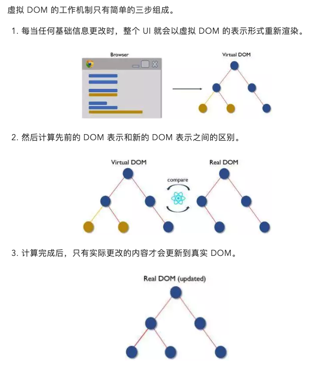

[官方文档](https://react.docschina.org/docs/faq-internals.html)

与其将 “Virtual DOM” 视为一种技术，不如说它是一种模式，人们提到它时经常是要表达不同的东西。在 React 的世界里，术语 “Virtual DOM” 通常与 React 元素关联在一起，因为它们都是代表了用户界面的对象。而 React 也使用一个名为 “fibers” 的内部对象来存放组件树的附加信息。上述二者也被认为是 React 中 “Virtual DOM” 实现的一部分。

查看功能测试部分的虚拟 dom 操作。

## 什么是 Virtual DOM

1. Virtual DOM 是一种**编程概念**。
2. 在这个概念里， **UI 以一种理想化的，或者说“虚拟的”表现形式被保存于内存中**，并通过如 ReactDOM **等类库**使之与“真实的” **DOM 同步**。这一过程叫做**协调**。
3. 这种方式**赋予了 React 声明式的 API**：您告诉 React 希望让 UI 是什么状态，React 就确保 DOM 匹配该状态。这使您可以从**属性操作、事件处理和手动 DOM 更新**这些在构建应用程序时必要的操作中**解放出来**。

注意区别于[shadow DOM](https://developer.mozilla.org/zh-CN/docs/Web/Web_Components/Using_shadow_DOM)，Shadow DOM 是一种浏览器技术。

## 原理

简单来说，就是用一个**轻量级的 dom 结构（只包含真实[dom 节点](https://developer.mozilla.org/zh-CN/docs/Web/API/Document_Object_Model/Introduction)的部分属性）**(用 js 模拟实现)，来模拟**重量级的 dom 结构(真实的 dom 结构)**，进而**通过轻量级结构的操作**来**减少重量级结构的操作**，最终达到性能优化的目的。

### 所谓的 Virtual DOM 算法。包括几个步骤

1. react 用 js 对象结构表示 DOM 树的结构(**虚拟轻量级 DOM**)；
2. 然后用这个树构建一个真正的 DOM 树，插到文档当中(render)；
3. 当状态变更的时候，**react 重新构造一棵新的 js 对象树**。然后用新的树和旧的树进行比较，**记录两棵树差异（diff 算法）**；
4. 把记的差异应用到步骤构建的真正的 DOM 树上，视图就更新了(patch，派发修改 dom)。

**Virtual DOM 本质上**就是在 JS 和 DOM 之间**做了一个缓存**。

可以类比 CPU 和硬盘，既然硬盘这么慢，我们就在它们之间加个**缓存**：既然 DOM 这么慢，我们就在它们 JS 和 DOM 之间加个**缓存**。CPU（JS）只操作内存（Virtual DOM），最后的时候再把变更写入硬盘（DOM）。

## 算法实现

1. 步骤一：用 JS 对象模拟 DOM 树；

用 JavaScript 来表示一个 DOM 节点是很简单的事情，你只需要记录它的节点类型、属性，还有子节点。

```js
// element.js
function Element(tagName, props, children) {
  this.tagName = tagName;
  this.props = props;
  this.children = children;
}

module.exports = function (tagName, props, children) {
  return new Element(tagName, props, children);
};
// 例如上面的 DOM 结构就可以简单的表示：

var el = require('./element');
var ul = el('ul', { id: 'list' }, [
  el('li', { class: 'item' }, ['Item 1']),
  el('li', { class: 'item' }, ['Item 2']),
  el('li', { class: 'item' }, ['Item 3']),
]);
```

2. 步骤二：比较两棵虚拟 DOM 树的差异;

正如你所预料的，比较两棵 DOM 树的差异是 Virtual DOM 算法最核心的部分，这也是所谓的 Virtual DOM 的 **diff 算法**。

两个树的完全的 diff 算法是一个**时间复杂度为 O(n^3)** 的问题。但是在前端当中，你**很少会跨越层级地移动 DOM 元素**。所以 Virtual DOM **只会对同一个层级的元素进行对比**。

元素只会和同一层级的 div 对比，第二层级的只会跟第二层级对比。这样算法复杂度就可以达到 O(n)。

- 深度优先遍历，记录差异
- 差异类型
  上面说的节点的差异指的是什么呢？对 DOM 操作可能会：替换掉原来的节点，例如把上面的 div 换成了 section 移动、删除、新增子节点，例如上面 div 的子节点，把 p 和 ul 顺序互换修改了节点的属性对于文本节点，文本内容可能会改变。例如修改上面的文本节点 2 内容为 Virtual DOM 2。
- 列表对比算法

3. 把差异应用到真正的 DOM 树上
   因为步骤一所构建的 JavaScript 对象树和 render 出来真正的 DOM 树的信息、结构是一样的。所以我们可以对那棵 DOM 树也进行深度优先的遍历，遍历的时候从步骤二生成的 patches 对象中找出当前遍历的节点差异，然后进行 DOM 操作。

## Virtual DOM 算法主要是实现上面步骤的三个函数：element，diff，patch

然后就可以实际的进行使用：

```js
// 1. 构建虚拟DOM
var tree = el('div', { id: 'container' }, [
  el('h1', { style: 'color: blue' }, ['simple virtal dom']),
  el('p', ['Hello, virtual-dom']),
  el('ul', [el('li')]),
]);

// 2. 通过虚拟DOM构建真正的DOM
var root = tree.render();
document.body.appendChild(root);

// 3. 生成新的虚拟DOM
var newTree = el('div', { id: 'container' }, [
  el('h1', { style: 'color: red' }, ['simple virtal dom']),
  el('p', ['Hello, virtual-dom']),
  el('ul', [el('li'), el('li')]),
]);

// 4. 比较两棵虚拟DOM树的不同
var patches = diff(tree, newTree);

// 5. 在真正的DOM元素上应用变更
patch(root, patches);
```

## VDOM 和真实 DOM 的区别和优化

虚拟 dom，在内存中操作，不直接操作真实 dom 节点，略过了重复 render 的问题，避免了频繁的 dom 操作。

优点：

1. **保证性能下限**
   1. 保证了代码的更新逻辑，怎么写操作 dom 的方式性能都不会太差；
   2. 虚拟 DOM **不会立马进行排版与重绘操作**，需要 diff -> patch；
   3. **虚拟 DOM 进行频繁修改，然后一次性比较并修改真实 DOM 中需要改的部分**，最后在真实 DOM 中进行排版与重绘，减少过多 DOM 节点排版与重绘损耗；
   4. 虚拟 DOM **有效降低大面积真实 DOM 的重绘与排版**，因为最终与真实 DOM 比较差异，可以只渲染局部；
2. **无需手动操作 DOM**；
3. 跨平台，相对于 jq 操作 dom；

缺点：

1. 内存占知用量过高；
2. 无法进行极致优化；
3. 首次渲染大量 DOM 时，由于多了一层虚拟 DOM 的计算，**会比 innerHTML 插入慢**。

## 虚拟 dom 能否性能优化

1. js 内存操作，要比 dom 操作快很多。
2. 在比较性能的时候，要分清楚初始渲染、小量数据更新、大量数据更新这些不同的场合。

并不真实的提高性能：

1. 如果你用 jquery 可以**精确地做出 dom 操作**，不多也不少，那没有什么 diff 算法可以比你更快。
2. 尤雨溪：[没有任何框架可以比纯手动的优化 DOM 操作更快](https://www.zhihu.com/question/31809713/answer/53544875)。

### 一般理解的提高性能：｜ 为什么虚拟 dom 会提高性能

#### 虚拟 dom 与真实 dom 的区别

| 真实的 DOM                          | 虚拟 DOM                              |
| :---------------------------------- | :------------------------------------ |
| 1. 更新较慢                         | 1. 更新较快                           |
| 2. 可以直接更新 HTML                | 2. 不能直接更新 HTML                  |
| 3. 元素更新时候创建一个新的 DOM     | 3. 元素更新时候更新 JSX               |
| 4. DOM 操作开销较大                 | 4. **DOM 操作开销较小**               |
| 5. 内存浪费严重（大量不必要的属性） | 5. 没有内存浪费（对象属性都是需要的） |

#### 虚拟 dom 会提高性能的原理

前提：

1. js 的执行要比 dom 操作快很多。
2. 轻量 js 对象替代重的 dom 节点。

为什么虚拟 dom 会提高性能：虚拟 dom 相当于在 js 和真实 dom 中间**加了一个缓存**，利用 **dom diff 算法避免了没有必要的 dom 操作，从而提高性能**。

**虚拟 DOM 是轻量级的 JavaScript 对象**，一开始只是真实 DOM 的一个副本。它是一个节点树，将组件列为对象及其属性和内容的列表。

React 的渲染功能从 React 的各个部分生成一个节点树。然后，它会根据由不同用户或系统行为引起的信息模型突变来更新此树。

#### 虚拟 DOM 具体实现步骤如下

1. 用 JavaScript 对象结构**表示 DOM 树的结构**，然后用这个树构建一个**真正的 DOM 树**，插到文档当中；
2. 当**状态变更**的时候，重新构造一棵新的**对象树**，虚拟 dom 结构。然后用新的树和旧的树进行比较，记录两棵树差异；
3. 把 2 所记录的差异应用到步骤 1 所构建的真正的 DOM 树上，视图就更新。


