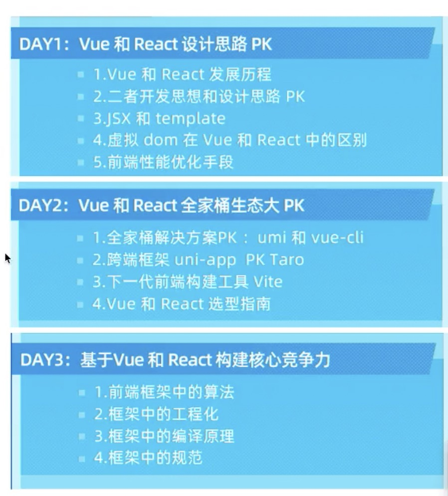

# React 与 Vue 的对比

1. 函数式有利于 tree sharking；

## vue3

1. vue3 回去分静态的还是动态的，静态的不进行 diff。
2. block 的概念，静态标记；
   1. prepack 理念；

## composition 和 hooks 区别

响应式： 数据变化了通知

vdom： 开始不知道，生成 vDom，然后 diff 变化

diff：最长递增子序列 + 双端判断

vue1 是没有 vdom 的，全是响应式。

### vue 的 vdom 和 双向数据绑定如何配合

1. 根据组件划分，组件之间响应式（双向绑定**耗性能**，全用响应式可能超过 16.6ms）；
2. 组件内部使用 vdom；

vdom: 使用 js 的 object 来描述 dom 节点；

## 2 Vue 和 React 全家桶生态大 PK
